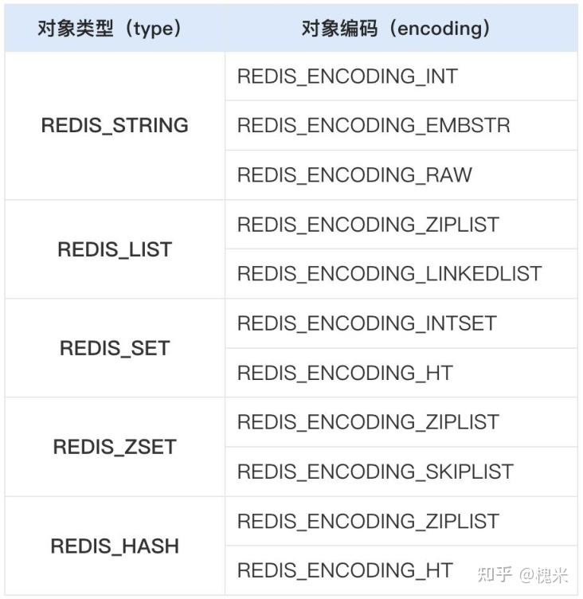

# redis的数据类型

redis是内存k-v数据库，k一般是字符串，[v的类型](https://redis.io/docs/latest/develop/data-types/)很丰富。

## 简述值类型

k值的类型有：`string`，`list`，`set`，`hash`，`zset` 这些是常见的、最早版本就有的，此外还有 `stream`，`geo`，`bitmap`，`bitfield` ...等后续版本增加的新类型。

注意区分 type 和 encoding，type 是对外表现的数据类型，encoding 则是内部实现采取的数据结构。

```shell
# 演示查看 type 和 encoding 的命令
127.0.0.1:6379> set id3467:status healthy
OK
127.0.0.1:6379> get id3467:status
"healthy"
127.0.0.1:6379> type id3467:status
string
127.0.0.1:6379> object encoding id3467:status
"embstr"

127.0.0.1:6379> sadd banned_ip 34.234.211.67 82.56.71.12
(integer) 2
127.0.0.1:6379> smembers banned_ip
1) "34.234.211.67"
2) "82.56.71.12"
127.0.0.1:6379> type banned_ip
set
127.0.0.1:6379> object encoding banned_ip
"listpack"
```
上面的 redis-cli 表明了redis数据类型的type和encoding的区别。encoding是底层实现数据结构，同一种type在不同的时候，会根据要保存的数据的大小以及其他因素选择合适的encoding，对应关系如下图；


（注意这个是旧版本的，最新版redis7.0有部分变化）

type是对外表现的行为，即使内部的encoding不一样，只要type一样，就共用一套操作api，例如set都可以asdd，sismember等命令。

有些type的的encoding随版本发生了变化，例如ziplist在redis7.0已经废弃了，使用listpack来代替。

总之，redis的实现各类type的底层数据结构，也就是这几种，`int`, `embstr`, `raw`, `ziplist`, `linkedlist`, `intset`, `hash`, `skiplist`。

[这一篇博客](https://zhuanlan.zhihu.com/p/715157057)介绍了这些数据结构。

## SDS简单动态字符串

## 链表linkedlist

## 哈希表
redis的哈希表，应对哈希冲突的方式是链地址法，这和golang的map的实现方式是类似的。并且在扩容的时候，都采用了渐进式再哈希方式，可以对比来学习。

## 跳表
### 节省内存的实现
可以看到有些节点值在很多层都会出现，在实现跳表的时候，我们可以把这些节点在不同层的分身当做单独的节点。这样实现起来非常容易。
也可以直接把这些分身都当做相同的节点，在节点内部维护每一层的`next`。这两种实现都有，在`Leetcode`中有一道题目就是`设计跳表`，可以参考那边的代码。

## 压缩列表 ziplist

### ziplist的迭代
ziplist在早期被这些type依赖：list、zset、hash。后来经过迭代，出现了quicklist以及listpack。现在redis7中，ziplist已经被listpack替代了。
ziplist被替代的原因是连锁更新带来的性能下降。