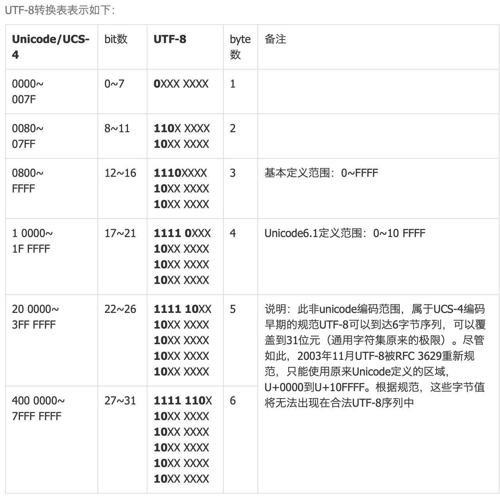

# 数据在计算机内的存储
计算机的硬盘和RAM都只能保存比特0和1，但是实际的信息种类很多：整数、浮点数、字符... 那么要如何保存这些内容呢？唯一的办法就是把建立规则，把这些内容映射为比特0和1的组合。

## ascii

ascii就是实现了上面的映射的一个规则，只不过，他只考虑了英文的常见符号和字符。


ascii保存了0-127编号的128个字符，只需要一个字节1byte(8bit) 就能表示一个英文字符。
保存字符到计算机时，只需要转换为01序列即可，解码的时候，也只需要按照字节拆分、查表翻译回字符即可。

## Unicode标准

unicode是一种标准，简单来讲，就是把世界上的一切符号，都对应一个唯一编码。
unicode = unicode字符集 + 多种可选的编码策略。

简单来讲，就是unicode标准这帮人，确定了一个大表，地球人日常用的大部分文字，都在这个表里面有一个序号，例如`a`就是97，`你`是20320号，等等。

怎么把这个97数字保存在计算机里面，保存了又怎么去把他转回字符，就是编码规则（策略），例如utf8，utf32。

等等，有人在这里会有困惑了，存一个数字编号还需要什么规则呢？直接转为二进制存不就好了吗？这个问题会在后面的编码规则中详细提到，如果你有这个疑问，原因在于：你或许不知道定长编码和边长编码的一些事情。

可以使用`python`的`ord`函数来获取某个字符对应的unicode编号，非常便捷！
```python
# test_ord.py
# 使用 python 的 ord 函数 来获取字符在 unicode 字符集中的编号

emoji = "😅"

chinese_char = "你"

unicode_id1 = ord(emoji)
unicode_id2 = ord(chinese_char)

print(unicode_id1, unicode_id2)

# ❯ python test_ord.py
# 128517 20320
```
当然如果你试过了很多字符，就会发现，上面的代码有时候会报错，就像下面这样！
```python
# test_ord.py
# ord函数在处理 💪🏿 的时候报错了！因为他不是 “一个字符”，更专业来讲，💪🏿 不止一个代码点（rune或code point）

emoji_with_2_code_point = "💪🏿"

unicode_id3 = ord(emoji_with_2_code_point)

print(unicode_id3)

# unicode_id3 = ord(emoji_with_2_code_point)
                #   ^^^^^^^^^^^^^^^^^^^^^^^^^^^^
# TypeError: ord() expected a character, but string of length 2 found
```
为了理解这个奇怪的现象，我们必须好好地了解一下 `unicode 代码点` 以及 `字素 grapheme` 这些概念。

### No character, but grapheme
“grapheme 字素 ———— 最小的、有意义的，人类书写单元。”


在unicode中，不再使用“字符”这样的字眼，而使用“字素”grapheme这个称呼。

在英文中，为了组成一个单词，你可能需要多个字母，例如`cat`需要c，a，t三个字母。
在现代汉语里面，`自行车` 这个词语需要三个字，自，行，车来构成，`c` `a` `t` `自` `行` `车` 这些单个的就叫字素，耽搁的表情也是一个字素。

我们的unicode编码，实际上就是在对这种能够单独书写的最小单位进行编号，而这种最小单位，就被称为grapheme。

唯一的坑点在于：有的字素对应一个unicode代码点，有的则对应多个。

### unicode 码点

code point 又是什么？ 在前面我们提到 unicode 标准维护了一张大表，这张表里的每一个东西都对应一个编号，实际上这些表里面的东西就是unicode代码点，前面我们说“为每一个字符编一个号”这实际上是不准确的 😁「请原谅我，毕竟之前我们还没引入字素，代码点这些概念」。

有些字符可以对应一个code point，有的则可以对应两个，例如👍🏻对应一个黄色的👍，和一个白色块；又比如有些字母上面带音标，实际上可能是两个码点：不带音标的字母 和 单独的音标 组合起来的。
“总之，一个看起来的字符（字素），有可能是unicode中的多个代码点的组合。” 如果不直到这一点，下面的代码的运行结果就会出乎意料。
```python []
# test_rune.py
# Python 3.12.0

s1 = "你是这个👍🏻"
s2 = "你是这个👍"
l1, l2 = len(s1), len(s2)
print("l1:", l1)
print("l2:", l2)

"""
❯ python test_rune.py
l1: 6
l2: 5
"""
```
```go []
// test_rune.go
// go version go1.22.1 darwin/arm64

package main

import (
	"fmt"
	"unicode/utf8"
)

func main() {
	s1 := "你是这个👍🏻"
	s2 := "你是这个👍"
	l1, l2 := len(s1), len(s2)
	fmt.Printf("l1: %v\n", l1)
	fmt.Printf("l2: %v\n", l2)
	r1, r2 := utf8.RuneCountInString(s1), utf8.RuneCountInString(s2)
	fmt.Printf("r1: %v\n", r1)
	fmt.Printf("r2: %v\n", r2)
}

/*
❯ go run test_rune.go
l1: 20
l2: 16
r1: 6
r2: 5
*/
```

### unicode 编码策略

unicode是一种标准，那么怎么对这个标准进行编码？有多个标准，例如utf8, utf16等。

#### utf32 定长编码
使用4字节的定长编码，把所有的代码点都编码为4个字节，32位。
utf32的优点是所有字符，无论常见和罕见，都编码成为相同长度的二进制串，这对于编码和解码十分方便。
缺点是浪费内存。

#### utf8 变长编码
utf8是变长编码，不同范围的代码点，对应的编码长度不一样，兼容ascii。
例如一个汉字，编码之后是三个字节。
utf8编码是变长编码，这样十分节省内存（相较于utf32定长编码来讲），但是在转换的时候就麻烦一点，因为你并不知道当前的这一个字节属于哪个字。

## utf8 编码汉字

一个汉字在utf8中，经过编码，长度是三个字节，这是为什么？
原因是在unicode编码标准中，中文汉字的编码范围正好落在 三字节编码的范围内。


可以使用[在线工具](https://www.metools.info/code/utf8235.html#google_vignette)进行编码
例如对 “你” 进行编码，结果是 E4BDA0，这是十六进制 对应的二进制是 11100100 10111101 10100000
是三字节。
第一个字节的前面4位是1110，后面两个字节的前两位都是10，这是规定好的。

`1110[0100] 10[111101] 10[100000]`
被中括号包围的 4 + 6 + 6 = 16位拼起来，就是`0100111101100000`
20320 对应的 就是汉字 你
在python中可以用ord函数得到字符对应的unicode码值（十进制）
```python
>>> s = "你"
>>> ord(s)
20320
```

也可以在go语言中验证
```go
// utf8_.go
package main

import (
	"fmt"
	"unicode/utf8"
)

func main() {
	s := "你6"
	l := len(s)
	fmt.Printf("l: %v\n", l) // 应该是4
	rn := utf8.RuneCountInString(s)
	fmt.Printf("rn: %v\n", rn)
	for i := range l {
		fmt.Printf("%b \n", s[i])
	}
}
```
注意这里可以看到，go语言中的rune。
```shell
❯ go run utf8_.go
l: 4
rn: 2
11100100 
10111101 
10100000 
110110 # 这个是第二个 rune 也就是 6 这个字符，在 ascii 范围内
```

再来看下下面的例子，就能知道 rune 实际上就是 utf8 的代码点。
```go
package main

import (
	"fmt"
	"unicode/utf8"
)

func main() {
	s := "你6"
	l := len(s)
	fmt.Printf("l: %v\n", l) // 应该是4
	rn := utf8.RuneCountInString(s)
	fmt.Printf("rn: %v\n", rn)
	for i := range l {
		fmt.Printf("%b \n", s[i])
	}

	s1 := "👍🏻" // 这个就含有两个 unicode 代码点
	fmt.Printf("s1: %v\n", s1)
	l1 := len(s1)
	fmt.Printf("l1: %v\n", l1) // 8
	rn1 := utf8.RuneCountInString(s1) // 2
	fmt.Printf("rn1: %v\n", rn1)
}
```

如果还需要知道一些编码的细节，可以看[这个视频](https://www.bilibili.com/video/BV14Ns8eEERu/)